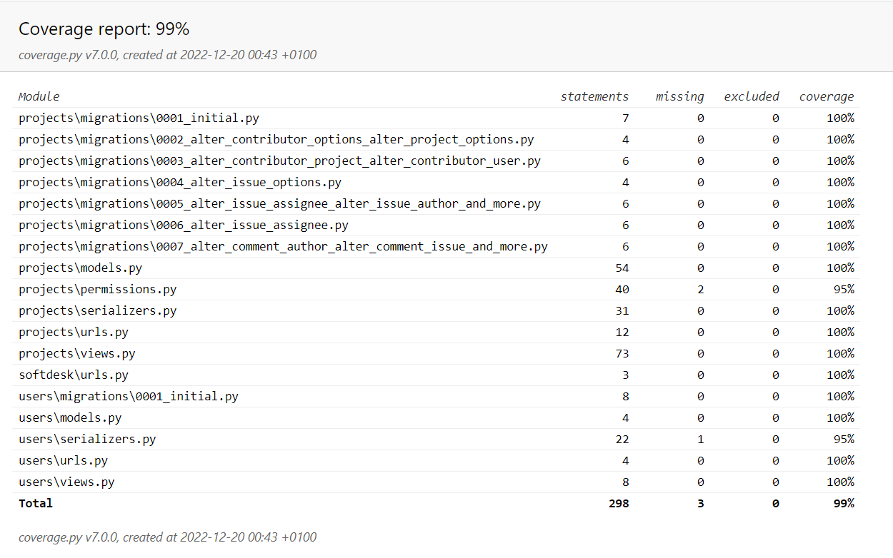
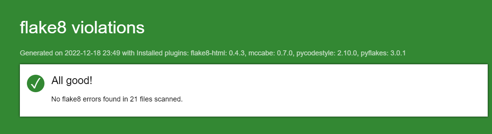

# Projet 10 DA-Python OC
***Livrable : API-SoftDesk, API de gestion et de suivi de problèmes techniques pour les trois platefrormes (sites web, applications Android et IOS)***

Testé sous Windows 11 - Python version 3.10.5 - Django 4.1.3 - DRF 3.14.0

L'application permet aux utilisateurs de créer des projets, 
d'ajouter des utilisateurs (contributeurs) à ces projets, 
de créer des problèmes au sein des projets et de leur attribuer des commentaires.

## Sommaire

**[1. Installation et lancement](#heading--1)**
  * [1.1. Windows](#heading--1-1)
  * [1.2. MacOS et Linux](#heading--1-2)

**[2. Informations d'utlisation](#heading--2)**
  * [2.1 Utilisateurs enregistrés en base de données](#heading--2-1)
  * [2.2 Liste des points de terminaison](#heading--2-2)

**[3. Tests et rapport flake 8](#heading--3)**
  * [3.1 Tests](#heading--3-1)
  * [3.2 Rapport flake 8](#heading--3-2)

       

### 1. Installation et lancement

#### 1.1 Windows :
   Depuis votre terminal, naviguez vers le dossier racine souhaité.

###### Récupération du projet
   Tapez :    

       git clone https://github.com/Cyl94700/P10_Op_Cl.git

###### Accéder au dossier du projet, créer et activer l'environnement virtuel
   Tapez :

       cd P10_Op_Cl
       python -m venv env 
       env\scripts\activate
    
###### Installer les paquets requis
   Tapez :

       pip install -r requirements.txt

###### Si nécessaire, faire les migrations
   Tapez :

      python manage.py migrate

###### Lancer le serveur Django
   Tapez :

      python manage.py runserver

Différents outils permettent de naviguer dans l'API :

- la plateforme [Postman](https://www.postman.com/) 
- l'outil de commandes [cURL](https://curl.se) 
- l'interface intégrée Django REST framework à l'adresse http://127.0.0.1:8000/ (points de terminaison indiqués en partie 2)

---------

####  1.2 MacOS et Linux :
   Depuis votre terminal, naviguez vers le dossier souhaité.

###### Récupération du projet
   Tapez :

       git clone https://github.com/Cyl94700/P10_Op_Cl.git

###### Accéder au dossier du projet, créer et activer l'environnement virtuel
   Tapez :

       cd P10_Op_Cl
       python -m venv env 
       source env/bin/activate
    
###### Installer les paquets requis
   Tapez :

       pip install -r requirements.txt
       cd litreview

###### Si nécessaire, faire les migrations
   Tapez :

      python manage.py migrate

###### Lancer le serveur Django
   Tapez :

       python manage.py runserver

Différents outils permettent de naviguer dans l'API :

- la plateforme [Postman](https://www.postman.com/) 
- l'outil de commandes [cURL](https://curl.se) 
- l'interface intégrée Django REST framework à l'adresse http://127.0.0.1:8000/ (points de terminaison indiqués en partie 2)

### 2. Informations d'utilisation

#### 2.1 Utilisateurs enregistrés en base de données

| *Identifiant* | *Mot de passe* |
|---------------|----------------|
| Admin         | adm12345       |
| User_1        | password999    |
| User_2        | password999    |
| User_3        | password999    |

#### 2.2 Liste des points de terminaison

| #   | *Point de terminaison d'API*                                              | *Méthode HTTP* | *URL (base: http://127.0.0.1:8000)*       |
|-----|---------------------------------------------------------------------------|----------------|-------------------------------------------|
| 1   | Inscription de l'utilisateur                                              | POST           | /signup/                                  |
| 2   | Connexion de l'utilisateur                                                | POST           | /login/                                   |
| 3   | Récupérer la liste de tous les projets rattachés à l'utilisateur connecté | GET            | /projects/                                |
| 4   | Créer un projet                                                           | POST           | /projects/                                |
| 5   | Récupérer les détails d'un projet via son id                              | GET            | /projects/{id}/                           |
| 6   | Mettre à jour un projet                                                   | PUT            | /projects/{id}/                           |
| 7   | Supprimer un projet et ses problèmes                                      | DELETE         | /projects/{id}/                           |
| 8   | Ajouter un utilisateur (collaborateur) à un projet                        | POST           | /projects/{id}/users/                     |
| 9   | Récupérer la liste de tous les utilisateurs attachés à un projet          | GET            | /projects/{id}/users/                     |
| 10  | Supprimer un utilisateur d'un projet                                      | DELETE         | /projects/{id}/users/{id}/                |
| 11  | Récupérer la liste des problèmes liés à un projet                         | GET            | /projects/{id}/issues/                    |
| 12  | Créer un problème dans un projet                                          | POST           | /projects/{id}/issues/                    |
| 13  | Mettre à jour un problème dans un projet                                  | PUT            | /projects/{id}/issues/{id}/               |
| 14  | Supprimer un problème d'un projet                                         | DELETE         | /projects/{id}/issues/{id}/               |
| 15  | Créer des commentaires sur un problème                                    | POST           | /projects/{id}/issues/{id}/comments/      |
| 16  | Récupérer la liste de tous les commentaires liés à un problème            | GET            | /projects/{id}/issues/{id}/comments/      |
| 17  | Modifier un commentaire                                                   | PUT            | /projects/{id}/issues/{id}/comments/{id}/ |
| 18  | Supprimer un commentaire                                                  | DELETE         | /projects/{id}/issues/{id}/comments/{id}/ |
| 19  | Récupérer un commentaire via son id                                       | GET            | /projects/{id}/issues/{id}/comments/{id}/ |

### 3. Tests et rapport flake8

#### 3.1 Tests
Pour lancer les tests, supprimez le dossier htmlcov présent à la racine.
Le fichier pytest.ini est configuré pour exécuter pytest et coverage en même temps.
Depuis le terminal, il suffit de taper :

     pytest

Le terminal indique en vert le nombre de tests réussis.
Puis, consultez le résulat dans le htmlcov nouvellement créé en ouvrant le fichier index.html avec un navigateur.

#### 3.2 Rapport flake8

Pour vérifier la cohérence du code avec la norme PEP8, vous pouvez lancer flake8-html et générer un rapport html.
Supprimez le dossier flake8_report situé à la racine du projet.
Depuis le terminal, placez-vous à la racine du projet et tapez :
 

      flake8 --format=html --htmldir=flake8_report

Le dossier flake8_report est de nouveau généré. Il contient le rapport global dans un fichier nommé index.html

